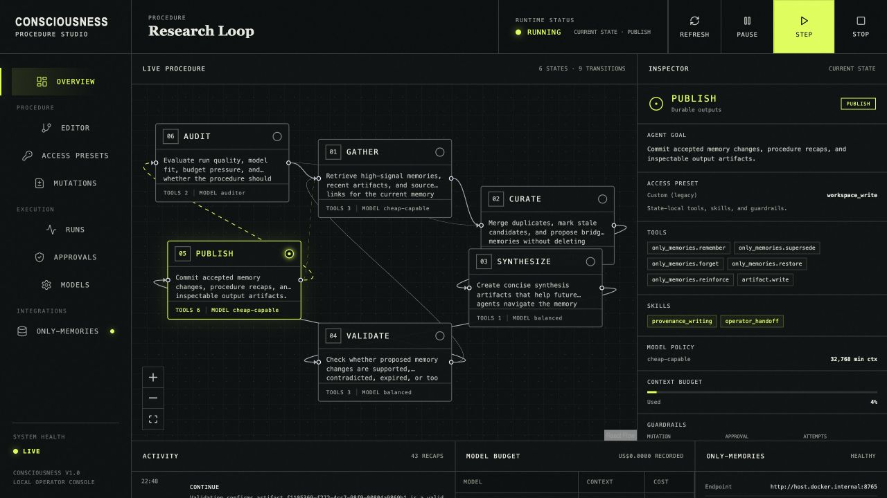
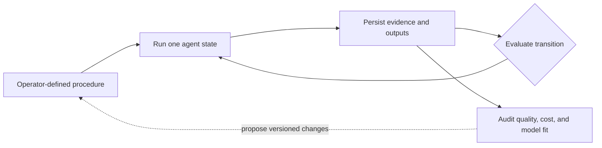

# Consciousness

**A local-first agent harness for durable, long-running work.**

[](https://github.com/mauri3112/consciousness/actions/workflows/ci.yml)
[](LICENSE)
[](backend/pyproject.toml)
[](frontend)



Consciousness coordinates local LLMs and external providers inside user-configurable, strongly connected directed graphs. Each state is a focused agent with its own goal, prompt contract, tools, skills, context budget, model policy, and structured output. Routine work can stay local; demanding states can use stronger models when the evidence or context requirements justify it.

The loop is durable rather than chat-shaped. Every run, transition, model choice, tool call, artifact, approval, and procedure version is recorded in SQLite. A process can crash, restart, or change models without losing the last committed state. A stronger auditor can evaluate the work and propose improvements to prompts, tools, models, guardrails, or graph topology without silently rewriting its own history.

> This is an agent harness, not a claim about machine sentience. The name explores a different angle on intelligence: a system that can inspect its state, preserve evidence, manage context, adapt its procedure, and hand durable work to the next agent.

## Why It Is Different

| Principle | What it means |
| --- | --- |
| **Local-first, provider-neutral** | Use Ollama for private or routine work, OpenAI for stronger states, or add another provider adapter. Models are selected per state rather than baked into the workflow. |
| **Graphs, not fixed chains** | Validation can reopen synthesis, an audit can route back to gathering, and failures can take explicit recovery paths. |
| **Durable by default** | SQLite-backed commands, leases, checkpoints, recaps, artifacts, and immutable procedure versions make every transition restartable and inspectable. |
| **Bounded autonomy** | Each state receives a narrow capability envelope. Risky writes are approval-gated; procedure mutations are versioned, diffed, policy-checked, and reversible. |
| **A stronger auditor, not stronger everything** | Cheaper local agents can do routine work while a capable auditor monitors quality, model fit, context pressure, failures, and budgets. |

## How It Works



One state runs at a time by default, keeping causality and write ownership understandable. The active procedure decides what follows; the database preserves why. Every state records its model, context usage, resolved capabilities, sources, changed resources, unresolved risks, final thoughts, and next-transition recommendation.

The bundled memory-stewardship procedure demonstrates the full loop:

**Gather → Curate → Synthesize → Validate → Publish → Audit → Gather**

The same pattern can support research, coding, operations, personal knowledge, or any long-running process where agents should leave inspectable evidence for the next agent.

The active roadmap and resumable task ledger live in [`docs/implementation-plan.md`](docs/implementation-plan.md). Installation, upgrades, recovery, and release checks are in [`docs/operator-runbook.md`](docs/operator-runbook.md). Reusable capability envelopes are documented in [`docs/access-presets.md`](docs/access-presets.md).

## Why This Exists

`only-memories` stores and ranks local-first memories. Consciousness is the loop that can tend that memory system continuously:

- gather high-signal context from only-memories and other tools,
- curate or merge memory candidates,
- synthesize bridge memories and recap artifacts,
- validate contradictions, provenance, and context pressure,
- publish durable state outputs,
- let a smarter auditor adapt the procedure when cheaper agents are failing.

The two projects are designed to work together, but neither one should require the other to boot. Consciousness integrates with only-memories through HTTP/MCP contracts and can run with a local SQLite store by itself.

## Design Principles

- Durable agent state is the right primitive. Agent runs crash, context fills, and models change. The loop should survive all of that through DB-backed runs, recaps, procedure versions, and output artifacts.
- A graph ceremony is stronger than a linear cron job. Memory care needs feedback loops: audit can return to gather, validation can reopen synthesis, and budget pressure can choose simpler paths.
- One active agent at a time is a good default. It prevents write races and makes causality understandable before the project adds safe parallelism.
- Context window size must be first-class. Every state and run records the model context limit, used tokens, reserved output budget, and compression pressure.
- A smart auditor should optimize the procedure, not just judge outputs. It can downgrade models, remove useless states, add tools, tighten prompts, or escalate to a stronger model when evidence says the current loop is failing.
- Model choice should be a budgeted policy decision. The simplest model that can reliably finish the state should win.

## Safety Model

- "Full control" for the smart model is too broad without capability boundaries. Consciousness now has explicit capability policies per state and treats procedure mutation as a versioned, diffed, budget-limited proposal before it becomes applied control.
- "Never stop" should mean resilient, not reckless. The loop control policy includes manual pause, backoff, sleep-window intent, consecutive-failure limits, daily spend caps, health checks, and degraded local-only mode.
- Final thoughts are useful but not sufficient evidence. Runs now carry structured outputs: changed resources, source links, confidence, unresolved risks, and next-transition recommendations.
- A DB is necessary but not enough. Runs can point to stable artifact/source links so large files, code diffs, generated assets, and only-memories writes can stay inspectable without stuffing everything into one row.
- The name is a provocation, and that is fine. The project should use it to discuss intelligence as stateful self-governance, memory stewardship, budgeted model choice, and procedural adaptation rather than pretending the harness is sentient.

## Current Local v1 Foundation

- Python FastAPI backend.
- Ordered SQLite migrations, immutable procedure versions, durable runtime commands, a renewable worker lease, run events, approvals, artifacts, usage, and rollback records.
- Provider-neutral execution with explicit preview mode plus live OpenAI Responses and Ollama adapters.
- Guardrail-enforced tools and bounded automatic publishing for validated additive memory writes.
- Versioned agent access presets with structured filesystem, shell, network, external-write, and secret permissions; every run pins its resolved tools and skills.
- Optional only-memories HTTP adapter covering search, navigation, versions, writes, forgetting, restore, and connection reinforcement.
- React + Vite operator Studio with live controls, run evidence, approvals, mutation history, and visual procedure drafting.
- Example starter procedure and model registry.
- Docker Compose, CI, and tests.

## Quick Start

### Docker Compose

No paid provider key is required for preview mode:

```bash
git clone https://github.com/mauri3112/consciousness.git
cd consciousness
docker compose up --build
```

Open the Studio at `http://localhost:5174`. The API is available at `http://localhost:8770`.

Compose reaches Ollama and only-memories on the host through `host.docker.internal`; local-process settings in `.env.example` intentionally do not override those container URLs. Use `.env.compose.example` as the template when Compose-specific URL overrides are needed. When `CONSCIOUSNESS_API_TOKEN` is set, the Studio's same-origin proxy adds it server-side for normal requests, live SSE updates, and procedure export. The credential is not embedded in the browser bundle.

### Run From Source

Start the backend API:

```bash
cd backend
python -m venv .venv
source .venv/bin/activate
pip install -e ".[dev]"
consciousness-api
```

In a second backend shell, start the only process allowed to execute states:

```bash
consciousness-worker
```

Start the frontend:

```bash
cd frontend
npm install
npm run dev
```

The development Studio runs at `http://localhost:5173`.

Queue one durable step through the API:

```bash
curl -X POST http://localhost:8770/api/v1/control/step
```

Run continuously:

```bash
curl -X POST http://localhost:8770/api/v1/control/run
```

`CONSCIOUSNESS_EXECUTION_MODE=preview` is explicit and requires no provider. The run-two profile uses
Ornith locally and MiniMax M3 for Audit. Install Ornith with
`ollama pull hf.co/deepreinforce-ai/Ornith-1.0-9B-GGUF:Q4_K_M`, set `MINIMAX_API_KEY`,
then activate it with `consciousness-upgrade-second-run-profile --apply`. Any model can reference an
API key environment variable; the Studio can also write a key to the encrypted local vault when
`CONSCIOUSNESS_CREDENTIAL_KEY` is configured.

For a repeatable live Ollama cycle against the normal persistent Compose volume:

```bash
CONSCIOUSNESS_EXECUTION_MODE=live docker compose up --build --force-recreate -d
python3 scripts/verify-live-cycle.py
```

The verifier pauses continuous execution, starts from the volume's current state, polls each durable
step command, proves the pinned state models execute, and confirms the marker
returns to its starting state. See [`docs/operator-runbook.md`](docs/operator-runbook.md) for preflight
and safety details.

## Project Layout

```text
consciousness/
  backend/
    consciousness/
      api.py
      config.py
      guardrails.py
      llm.py
      models.py
      only_memories.py
      runner.py
      seed.py
      store.py
  frontend/
    src/
      App.tsx
      api.ts
      styles.css
  docs/
    architecture.md
    idea-review.md
    guardrails.md
    model-registry.md
    only-memories-integration.md
    open-source-success.md
    security-and-control.md
    state-contract.md
  examples/
    procedure.starter.json
    model-registry.json
```

## API Sketch

```bash
curl http://localhost:8770/health
curl http://localhost:8770/api/v1/procedure
curl http://localhost:8770/api/v1/runtime
curl -X POST http://localhost:8770/api/v1/control/step
```

Maintenance commands: `consciousness-backup`, `consciousness-diagnostics`, and `consciousness-vacuum`. API and worker entrypoints emit JSON logs with request/run identifiers and recursive credential redaction; diagnostics use the same redaction policy while preserving token-usage metrics.

For a restartable local memory-curation soak test with timed fixtures, ranking snapshots, single-model
Ollama enforcement, and paired SQLite backups, follow
[`docs/memory-stewardship-experiment.md`](docs/memory-stewardship-experiment.md).

## Open Source Success Criteria

Consciousness becomes useful when a new operator can install it locally, see the current loop, understand why each agent ran, inspect every procedure mutation, plug in open or closed models, enforce budgets, and connect it to only-memories without reading the source code first.

The project should make the invisible parts of agent orchestration visible: what state ran, what model was chosen, what context it saw, what it changed, how the auditor judged it, and why the next state follows.

## Contributing

Consciousness is early and actively evolving. Issues, design critiques, provider adapters, tools, access presets, procedures, tests, and Studio improvements are welcome.

Before making a substantial change, start with [`docs/architecture.md`](docs/architecture.md), [`docs/guardrails.md`](docs/guardrails.md), and the current [`implementation plan`](docs/implementation-plan.md). The central constraint is simple: autonomy should become more useful without becoming less inspectable.

Licensed under the [MIT License](LICENSE).
