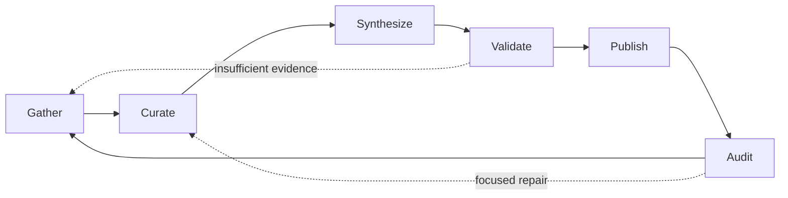

# Architecture

Consciousness has four layers:

1. Procedure graph: states, transitions, guards, weights, and current state.
2. Execution records: one active run at a time, with model, context, tools, skills, final thoughts, and changes.
3. Governance records: auditor recaps and procedure mutations.
4. Integrations: optional adapters such as only-memories, local model runtimes, and filesystem or Git sources.

## Procedure Graph

The starter graph is strongly connected:

Each state owns:

- domain,
- goal template,
- prompt contract,
- output contract,
- tools,
- skills,
- minimum context size,
- model policy.

## Execution Loop

The API and worker are separate processes. The API writes durable commands; the worker must hold the renewable singleton lease before it may execute:

1. Read the current state.
2. Assemble and persist the context manifest, then choose the cheapest eligible model after context, capability, privacy, and budget constraints.
3. Start a run pinned to the immutable procedure version.
4. Checkpoint provider and tool activity through append-only events and idempotent tool-call records.
5. Validate the state-specific structured payload and record usage, cost, sources, artifacts, changes, and operational final thoughts.
6. Apply safe additive actions or stage risky actions for approval.
7. Evaluate the declarative transition guard and atomically advance the current-state marker.

Preview execution is explicit. Live execution uses the OpenAI Responses or Ollama chat adapter.

## Restart Semantics

SQLite is the source of truth. An expired worker lease marks stale in-flight runs interrupted. A later attempt re-executes the state from committed checkpoints; uncertain non-idempotent writes are never replayed automatically.

The system should never rely on an in-memory queue as the only copy of procedural state.

## Procedure Mutation

A smart auditor can change the procedure, but successful open-source adoption depends on making those changes inspectable. A mutation should include:

- previous procedure version,
- proposed procedure version,
- exact diff,
- reason,
- budget impact,
- tools or skills added or removed,
- model changes,
- rollback path,
- evidence from recent runs.
