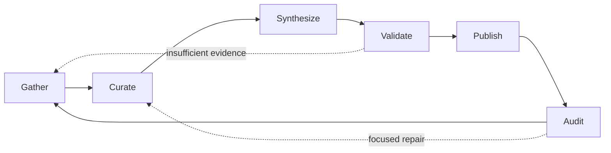

# Architecture

Consciousness has four layers:

1. Procedure graph: states, transitions, guards, weights, and current state.
2. Execution records: one active run at a time, with model, context, tools, skills, final thoughts, and changes.
3. Governance records: auditor recaps and procedure mutations.
4. Integrations: optional adapters such as only-memories, local model runtimes, and filesystem or Git sources.

## Procedure Graph

The starter graph is strongly connected:

Each state owns:

- domain,
- goal template,
- prompt contract,
- output contract,
- tools,
- skills,
- minimum context size,
- model policy.

## Execution Loop

The loop is intentionally simple in the scaffold:

1. Read the current state.
2. Choose the cheapest enabled model that satisfies the state context and policy.
3. Start a durable run row.
4. Execute the state.
5. Store final thoughts, changed resources, and context usage.
6. Record an auditor or loop-recorder recap.
7. Advance through the highest-weight active transition.

Later versions should replace the deterministic scaffold executor with provider adapters and structured agent output validation.

## Restart Semantics

SQLite is the source of truth. If the process crashes, a recovery agent should inspect unfinished runs, decide whether to resume, replay, mark failed, or request a stronger audit pass.

The system should never rely on an in-memory queue as the only copy of procedural state.

## Procedure Mutation

A smart auditor can change the procedure, but successful open-source adoption depends on making those changes inspectable. A mutation should include:

- previous procedure version,
- proposed procedure version,
- exact diff,
- reason,
- budget impact,
- tools or skills added or removed,
- model changes,
- rollback path,
- evidence from recent runs.
